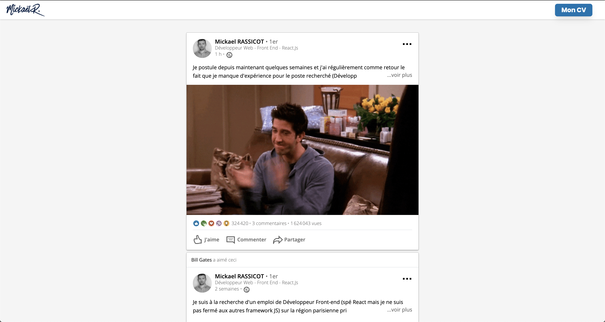

# My LinkedIn Resume

## What's this ?
This is a resume introducing me to the LinkedIn way

## Content
* Posts
* Comments
* SubComments
* Stats (views, likes, etc ...)

## Main Stacks
| Stacks    |            |                       |                       |
|:---------:|:----------:|:---------------------:|:---------------------:|
| **Front** | React.js   | Webpack               | Tailwindcss           |

## Installation & Usage
1. First clone the repo into your folder
2. Then execute `npm i` or `yarn install`
3. Then execute `npm start` or `yarn start`

> #### Data is provided via the file feddData.js with the help of Faker for the creation of false profiles and false statistics

You can reach me on GitHub or on [StackOverflow](https://stackoverflow.com/users/13077371/mkds17)

Peace ! 
